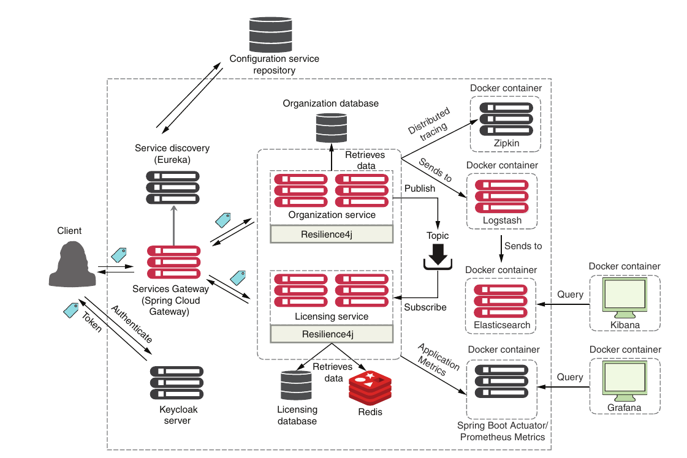

## MICROSERVICES PROJECT
## Project
Simple spring boot microservices project based on [Spring Microservices in Action book](https://www.manning.com/books/spring-microservices-in-action-second-edition) and [presentation by Thomas Vitale](https://www.youtube.com/watch?v=jkP199zzknw).
You can have more info about the content looking the architecture below. You may read the book with this repo as a reference, due the fact that has major upgrades and fixes.
 

Credits: https://github.com/ihuaylupo/manning-smia

## Requirements

- [JDK 17](https://jdk.java.net/java-se-ri/17)  - gradle wrapper will use gradle 7.5.1, which supports java 18. 
- [Docker 20.10+](https://www.docker.com/products/docker-desktop/) - starting from version 20.10, the Docker Engine supports communicating with the Docker host via host.docker.internal on Linux.
- [Docker-compose](https://docs.docker.com/compose/install/) - I have used Docker Compose 2.14.2 with Docker 20.10.22

## How to run it

### Windows

```bash
.\start_win.bat
```

### Linux

```bash
./start_linux.sh
```

